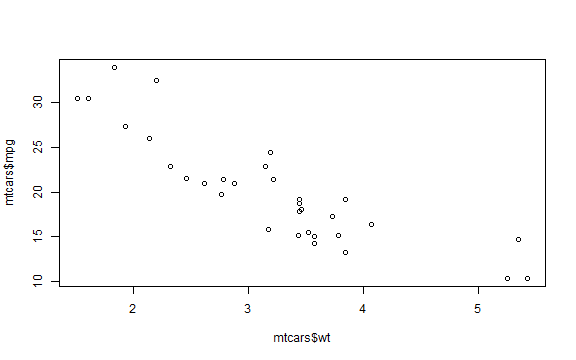

## Project Summary
I have built a simple miles per gallon fuel consumption app, based on the mtcars data set. The predictors I used were car weight and engine horsepower.

---
## Data set analysis
The mt cars data set has 11 variables:


```r
str(mtcars)
```

```
## 'data.frame':	32 obs. of  11 variables:
##  $ mpg : num  21 21 22.8 21.4 18.7 18.1 14.3 24.4 22.8 19.2 ...
##  $ cyl : num  6 6 4 6 8 6 8 4 4 6 ...
##  $ disp: num  160 160 108 258 360 ...
##  $ hp  : num  110 110 93 110 175 105 245 62 95 123 ...
##  $ drat: num  3.9 3.9 3.85 3.08 3.15 2.76 3.21 3.69 3.92 3.92 ...
##  $ wt  : num  2.62 2.88 2.32 3.21 3.44 ...
##  $ qsec: num  16.5 17 18.6 19.4 17 ...
##  $ vs  : num  0 0 1 1 0 1 0 1 1 1 ...
##  $ am  : num  1 1 1 0 0 0 0 0 0 0 ...
##  $ gear: num  4 4 4 3 3 3 3 4 4 4 ...
##  $ carb: num  4 4 1 1 2 1 4 2 2 4 ...
```

---
## Feature Selection
I have decided to use 2 features as mpg predictors. These features are car weight and engine horsepowers. it is possible to see that there is a strong relation between mpg and the 2 predictors, for example this is a scatterplot of mpg and weight:

```r
plot(mtcars$wt, mtcars$mpg)
```



---
## Model Creation
I have built the model using the linear model function, and these are the results:

```r
fit <- lm(mpg~hp+wt, data=mtcars)
summary(fit)$r.squared
```

```
## [1] 0.8267855
```
---

